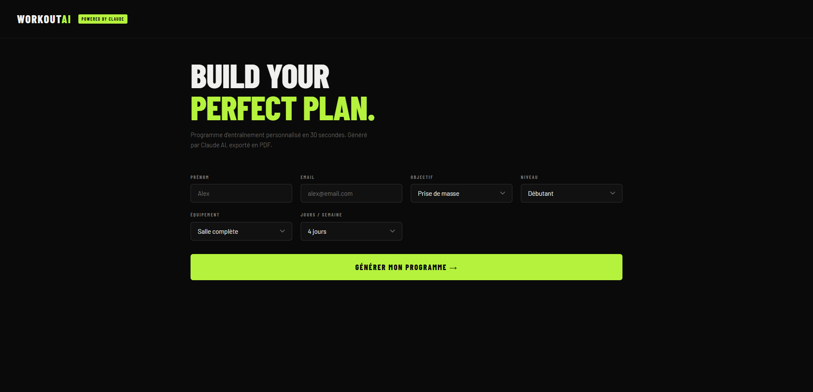
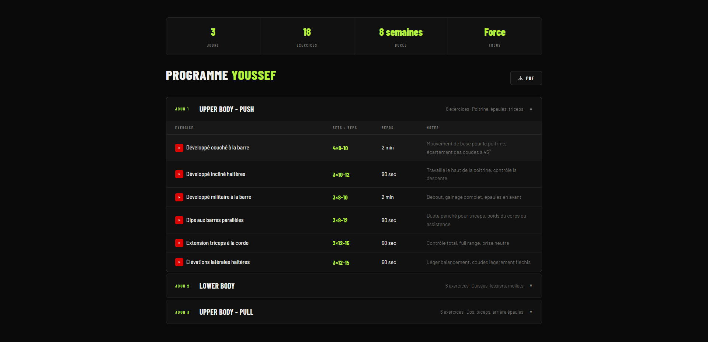

# WorkoutAI — Générateur de programmes d'entraînement par IA

Application web qui génère des programmes d'entraînement personnalisés via l'API Claude (Anthropic). L'utilisateur renseigne ses paramètres (objectif, niveau, équipement, fréquence), Claude génère un programme structuré, et l'app le rend en interface interactive avec export PDF.

> **Niveau 1 du portfolio AI Integration** — démontre l'intégration d'un LLM dans une app front-end avec gestion sécurisée de la clé API via proxy serverless.

## Démo

### Formulaire de génération


### Programme généré par Claude


## Architecture

```
workout-program-generator/
├── index.html              # Squelette HTML
├── css/
│   └── styles.css          # Tous les styles
├── ai/                     # Couche IA isolée
│   ├── prompts.js          # Prompts versionnés
│   ├── claude-client.js    # Client API (via proxy)
│   └── parser.js           # Parsing & validation des réponses LLM
├── js/
│   ├── main.js             # Orchestration
│   └── pdf.js              # Génération PDF
└── prompts/
    └── workout_generator.md  # Documentation prompt engineering
```

### Choix d'architecture

- **Couche IA isolée dans `ai/`** : le client Claude, les prompts et le parser sont séparés du reste de l'app pour faciliter la maintenance et le versioning des prompts.
- **Parser défensif** : un LLM ne retourne pas toujours du JSON pur. Le module `parser.js` extrait, parse et valide la structure avant de la passer au reste de l'app.
- **Proxy Cloudflare Worker** : la clé API Anthropic n'est jamais exposée côté client. Tous les appels passent par un Worker qui injecte la clé en serveur.

## Stack technique

- **Front** : HTML, CSS, JavaScript (ES Modules)
- **IA** : Anthropic Claude API (modèle `claude-haiku-4-5`)
- **Proxy** : Cloudflare Worker (clé API en Secret)
- **PDF** : jsPDF
- **Hébergement** : GitHub Pages

## Installation locale

```bash
git clone https://github.com/youssefmkb/workout-program-generator.git
cd workout-program-generator
```

Ouvrir `index.html` avec Live Server (extension VS Code) — les ES Modules requièrent un serveur HTTP local.

### Configuration du proxy

L'app appelle un Cloudflare Worker qui forward les requêtes vers `api.anthropic.com`. Pour utiliser ta propre clé :

1. Créer un Worker sur [cloudflare.com](https://cloudflare.com)
2. Coller le code du proxy (voir `docs/cloudflare-worker.js` à venir)
3. Ajouter la clé Anthropic en variable Secret : `ANTHROPIC_API_KEY`
4. Mettre à jour `PROXY_URL` dans `ai/claude-client.js`

## Prompt engineering

Le prompt complet est documenté dans [`prompts/workout_generator.md`](prompts/workout_generator.md).

Stratégie : forcer Claude à retourner uniquement du JSON valide en spécifiant le format exact, en interdisant tout texte hors JSON, et en ajoutant un parser tolérant côté client (regex `/\{[\s\S]*\}/`).

## Roadmap

- [ ] Envoi du programme par email (EmailJS)
- [ ] Sauvegarde des programmes générés (localStorage)
- [ ] Mode "progression" : génération multi-cycles avec progression de charges
- [ ] Streaming de la réponse Claude pour affichage progressif

## Author

**Youssef Mokhbi** — AI Automation & Integration Engineer

- LinkedIn: [linkedin.com/in/youssef-mokhbi-654a9b10a](https://linkedin.com/in/youssef-mokhbi-654a9b10a)
- GitHub: [github.com/youssefmkb](https://github.com/youssefmkb)

Certifications Anthropic : Claude 101 · AI Fluency · Building with the Claude API
